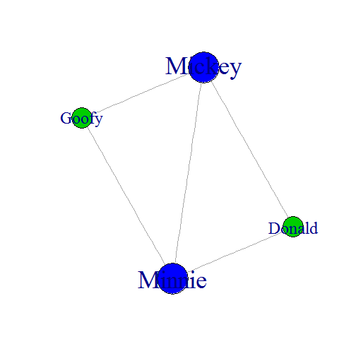
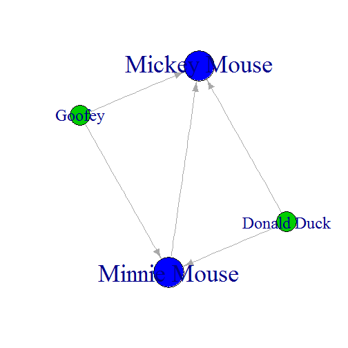

Graph Explorer presentation
========================================================
author: Mark Stam
date: Fri Aug 15 11:47:15 2014
transition:rotate
font-family: 'Trebuchet MS'

Contents
========================================================

For more details on authoring R presentations click the
**Help** button on the toolbar.

- Bullet 1
- Bullet 2 
- Bullet 3

Social Network Analysis
========================================================
Social network analysis (SNA) is the use of network theory to analyse social networks. Social network analysis views social relationships in terms of network theory, consisting of nodes, representing individual actors within the network. These networks are often depicted in a social network diagram, where nodes are represented as points and ties are represented as lines.

 

Graph information
========================================================
The Graph explorer will show some important details about the network,
like who's connected to who and which nodes have an higher degree than other nodes

```
       Donald Goofy Minnie Mickey
Donald      0     0      1      1
Goofy       0     0      1      1
Minnie      1     1      0      1
Mickey      1     1      1      0
```

```
       degree rank
Minnie           3
Mickey           3
Donald           2
Goofy            2
```


Slide With Plot
========================================================

 

Graph example
========================================================
 
